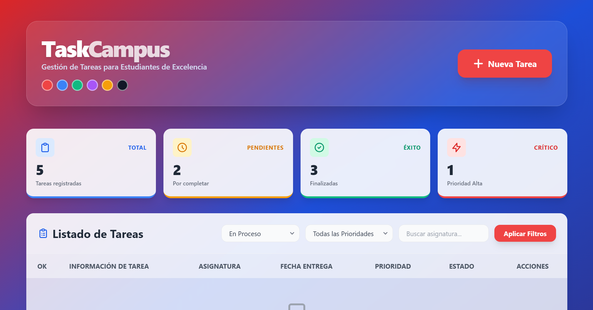
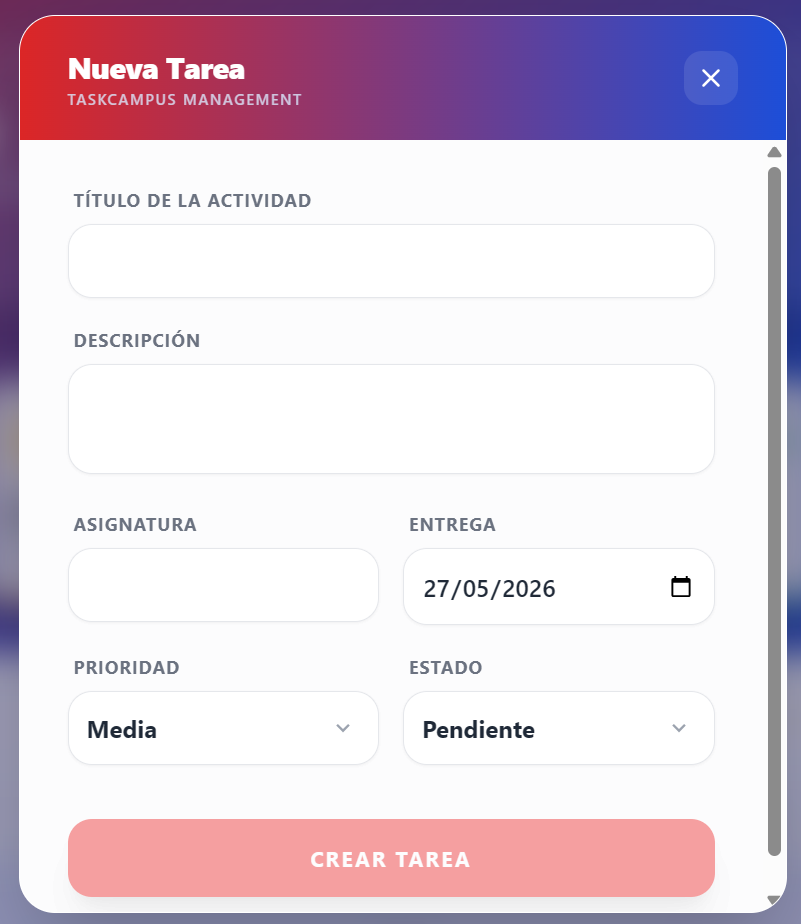

# TaskCampus

Aplicación web para la gestión de tareas estudiantiles desarrollada con **Angular**, **FastAPI** y **PostgreSQL**. El proyecto sigue la metodología **Spec Driven Development** (SDD) y utiliza la estructura de **Spec Kit**.

## Características Principales
- **Gestión de Tareas**: CRUD completo de actividades académicas.
- **Filtrado Avanzado**: Búsqueda por asignatura, estado y prioridad con respuesta inmediata.
- **Finalización Rápida**: Checkboxes integrados en la tabla para marcar tareas completadas al instante.
- **Sistema de Temas Globales**: Personalización visual con 6 paletas de colores (Rojo, Azul, Verde, Morado, Amarillo y Negro) con persistencia en el navegador.
- **Diseño Moderno**: Interfaz modular, responsiva y con ventanas modales ergonómicas.

## Galería de Imágenes
| Vista Principal | Modal de Tareas |
| :---: | :---: |
|  |  |

| Temas de Colores | Resumen Estadístico |
| :---: | :---: |
|  |  |

## Estructura del Proyecto
- `specs/`: Documentación técnica y planes de trabajo bajo estándar Spec Kit.
- `frontend/`: Aplicación cliente en Angular 17+ con Tailwind CSS.
- `backend/`: API REST en Python 3.9+ utilizando FastAPI y SQLAlchemy.
- `.specify/`: Configuraciones de agentes y flujos de Spec Kit.

## Requisitos Previos
- Node.js (v18+) y npm
- Python (3.9+)
- PostgreSQL (Base de datos `taskcampus` creada)

## Ejecución Rápida (Unificado)
Para iniciar tanto el Backend como el Frontend con un solo comando, utiliza el script automatizado:
```bash
./iniciar.sh
```
*Este script configurará el entorno virtual, instalará dependencias y lanzará ambos servidores en paralelo.*

## Configuración Manual
### Backend (Python)
1. Navegar a la carpeta `backend`.
2. Crear entorno virtual: `python3 -m venv venv` y activarlo `source venv/bin/activate`.
3. Instalar dependencias: `pip install -r requirements.txt`.
4. Configurar `.env` con la URL de PostgreSQL.
5. Iniciar: `PYTHONPATH=.. uvicorn principal:app --reload`.

### Frontend (Angular)
1. Navegar a la carpeta `frontend`.
2. Instalar dependencias: `npm install`.
3. Iniciar: `npm start`.
4. Acceso: `http://localhost:4200`.

## Endpoints de la API
| Método | Ruta | Descripción |
|--------|------|-------------|
| GET | `/tareas` | Listar tareas (soporta filtros: estado, prioridad, asignatura) |
| GET | `/tareas/{id}` | Consultar una tarea específica |
| POST | `/tareas` | Crear una nueva tarea |
| PUT | `/tareas/{id}` | Actualizar una tarea existente |
| DELETE | `/tareas/{id}` | Eliminar una tarea |
| GET | `/tareas/resumen` | Obtener resumen estadístico |

## Metodología y Nomenclatura
- **Spec Driven Development**: Desarrollo basado en especificaciones técnicas previas.
- **Idioma**: Todo el código fuente (variables, funciones, componentes) y la interfaz están en **español**.
- **Control de Versiones**: Uso riguroso de ramas y Pull Requests registrados en `PULL_REQUESTS.md`.

---
**Universidad Técnica de Machala** &bull; 2026
